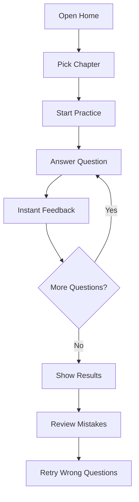

## 1. Product Overview
Chapterwise SSC CGL 2026 PYQ practice platform to solve questions in a clean, exam-like interface with instant feedback and performance summary.
- Helps aspirants practice by topic (e.g., Percentage), track accuracy, and revisit mistakes quickly
- Value: faster revision + targeted practice without distractions

## 2. Core Features

### 2.1 Feature Module
1. **Chapter Selection**: list of chapters (starting with “Percentage”) with question count and last score
2. **Practice Session**: one-question-at-a-time practice with options, timer (optional), and instant validation
3. **Results & Review**: session score, time taken, accuracy, question-wise review, and retry wrong questions

### 2.2 Page Details
| Page Name | Module Name | Feature description |
|-----------|-------------|---------------------|
| Home | Chapter grid | Chapter cards, search/filter, “Continue” CTA |
| Practice | Question card | Question text, options, select & submit, show correct answer, next/prev, progress bar |
| Results | Analytics + review | Score summary, list of wrong/unattempted, jump-to-question, retry wrong |

## 3. Core Process
User selects chapter → starts practice → answers questions → views results → reviews mistakes → retries wrong questions.

## 4. User Interface Design
### 4.1 Design Style
- Theme: dark-ink background with off-white surfaces; one strong accent (electric lime / cyan) for progress & correct
- Typography: distinctive heading font + readable body font; tight, exam-focused layout
- Layout: desktop-first centered content, card-based, sticky top progress/header
- Interaction: subtle transitions, keyboard-first (1-4 for options, Enter to submit, N for next)

### 4.2 Page Design Overview
| Page Name | Module Name | UI Elements |
|-----------|-------------|-------------|
| Home | Chapter cards | Card grid, search box, stats badges, hover lift |
| Practice | Question workspace | Progress bar, question meta (Q no, year), option list, submit/next buttons, feedback panel |
| Results | Summary panel | Score ring/bar, time taken, review list with status chips, retry CTA |

### 4.3 Responsiveness
Desktop-first; mobile adaptive with single-column layout, larger tap targets, and sticky bottom action bar for Submit/Next.
