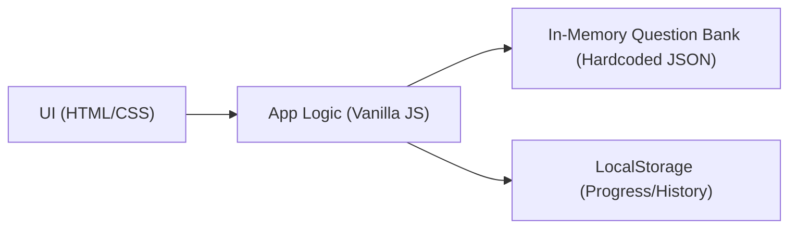

## 1. Architecture Design

## 2. Technology Description
- Frontend: Single static HTML page + CSS + Vanilla JavaScript (no frameworks)
- Data: Hardcoded chapterwise question JSON inside JS file (or inline script)
- Persistence: localStorage for last attempt, best score, and per-question status
- Backend: None

## 3. Route Definitions
| Route (hash) | Purpose |
|-------------|---------|
| #/home | Chapter selection |
| #/practice?chapter=percentage | Practice flow |
| #/results?chapter=percentage | Session summary + review |

## 4. Data Model (Client Side)
### 4.1 Structures
- Chapter: `{ id, title, questions: Question[] }`
- Question: `{ question_number, text, options: {A,B,C,D}, correct_answer_index, year }`
- AttemptState: `{ selectedIndex, isCorrect, isSubmitted, timeMs }`

### 4.2 Storage Keys
- `pyq:lastSession:<chapterId>`
- `pyq:best:<chapterId>`
